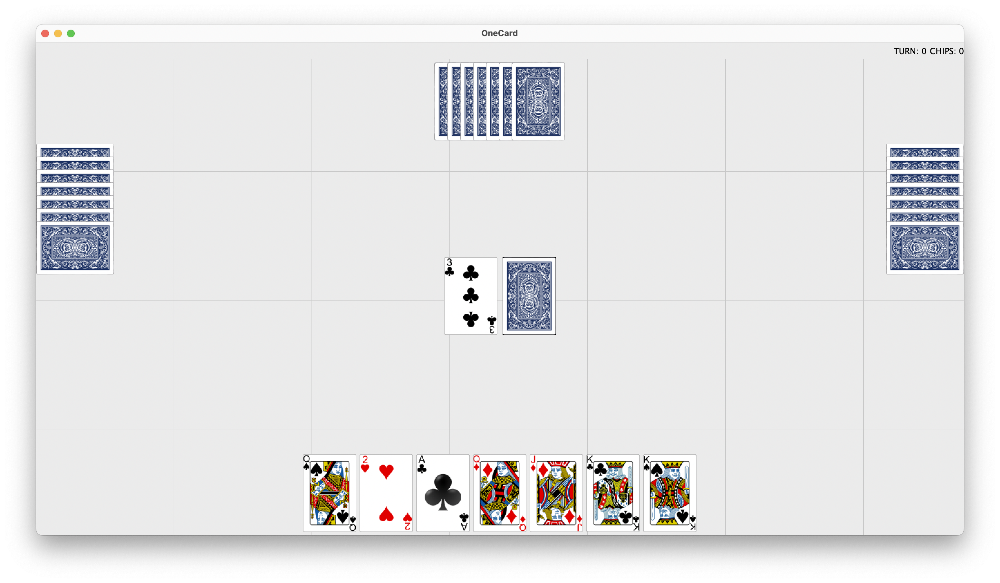

# One Card Game
One Card Game 프로젝트는 원카드게임을 자바를 사용해 GUI로 구현한 것이다. 11월 17일에 시작하여 12월 14일에 마무리되어, 총 28일 동안 개발했다. 

## Description
프로젝트의 목적은 [원카드](https://en.wikipedia.org/wiki/One-card) 게임의 규칙에 맞게 상호작용 가능한 카드게임을 구현하는 것이다. 현재로서는 자기 자신을 포함한 4명의 플레이어로 게임이 진행된다. 프로그램을 실행하면 로그인을 하는 창이 뜨고 이름을  입력한 후 버튼을 누르면 본격적으로 게임 참여가 가능하다. 동,서,남,북 방향으로 플레이어를 배치하고 정 가운데에는 카드를 뽑는 덱과 카드를 놓는 덱을 배치했다. 좌측 상단에는 게임 로그를 알려주고 우측 상단에는 시행된 턴의 수와 칩의 개수를 알려준다. 게임이 끝나면 다시 게임을 할건지 묻는 창이 나와 선택할 수 있다. 

 

## Gameplay 
One Card Game은 3명의 컴퓨터플레이어와 게임을 한다. 게임을 시작하며 모든 플레이어에게 7장의 카드가 주어진다. 플레이어는 (1) 자기의 패를 눌러 규칙에 맞는 카드를 제출하거나 (2) 낼 수 있는 카드가 없어 카드를 먹거나 (3) 턴을 넘기고 싶어 카드를 뽑는 덱을 눌러 일부러 카드를 얻을 수 있다. (1), (2), (3) 중 하나의 행동을 하면 다음 턴으로 넘어간다. 

  ### 게임의 규칙
  가장 최근에 놓인 카드를 플레이어들이 볼 수 있다. 플레이어는 이 카드와 규칙에 맞게 한 턴당 하나의 카드를 내어야하고, 카드를 낼 수 없다면 한 장의 카드를 먹어야 한다. 
  카드의 경우 일반카드, 공격카드, 특수카드가 있다.  
  -일반카드 : 3 ~ 10에 해당하는 수를 가진다. 일반카드의 경우 모양이 같거나 숫자가 같으면 카드를 낼 수 있다.  
  -공격카드 : 1, 2, 조커가 이에 해당한다. 1은 3장의 카드를, 2는 2장의 카드를, 조커의 경우 이 프로젝트에서는 흑조커와 색조커 모두 5장을 다음턴의 사람에게 먹일 수 있다. 즉, 공격효과를 지닌다. 공격은 누적될 수 있으며 카드를 먹는 즉시 공격의 효력을 잃는다. 효력을 잃은 카드 위에는 일반카드와 동일한 카드 제출 규칙을 가지며, 조커의 경우 아무 카드나 놓아도 된다.   
  -특수카드 : J, Q, K가 이에 해당한다. J의 경우 다다음턴으로 넘겨준다. Q의 경우 카드를 내는 방향을 반대로 바꿔준다. K의 경우 카드를 연속하여 한 장 더 낼 수있도록 한다.(K카드를 낸 후 낼수 있는 카드가 없다면 한 장 먹어야한다)

  카드를 뽑는 덱에서 뽑을 수 있는 카드가 없으면, 카드를 놓는 덱에서 제일 위의 카드를 제외한 나머지를 카드를 뽑는 덱으로 이동시켜준다. 

  가지고 있는 카드의 수가 16장이 되는 경우 카드를 자신이 가진채로 죽게 되어 컴퓨터의 경우 더 이상 게임에 참여할 수 없고 사람의 경우 패배하게 된다.  

 [게임 룰](https://namu.wiki/w/원카드#s-4)을 통해 더 자세한 정보를 알 수 있다. 

## Code Explanation
- OneCardGame
  전반적인 게임의 흐름을 다루는 클래스이다. 컴퓨터가 카드를 내거나 먹는 규칙, 플레이어가 카드를 먹거나 내는 규칙, 방향을 정해주는 원리 등을 담은 클래스로 게임이 돌아가도록하는 가장 중요한 클래스이다. 
  - Dealer
    카드를 다루는 클래스이다. 플레이어에게 카드를 주거나 카드를 받아 덱에 추가한다. 카드덱의 카드수가 0이 될 경우 다시 채워주는 역할까지 포함하여 전반적인 카드의 움직임에 관여한다. 
    - CardDeckPut
      카드를 놓는 덱이다. 이에 관련된 정보를 가지고 있다.
    - CardDeckStart
      카드를 뽑는 덱이다. 이에 관련된 정보를 가지고 있다. 카드를 옮길 수 있는 기능을 가진다. 
  - CardPlayer
    컴퓨터플레이어와 사람플레이어의 공통적인 기능이 있는 클래스이다. 놓인 카드를 기준으로 자신의 패에서 가능한 카드를 모아주는 함수가 존재한다. 
    - HumanPlayer
      놓인 카드를 기준으로 뽑을 수 있는 카드 여부와 카드를 모은다.
    - ComputerPlayer
      놓인 카드를 기준으로 뽑을 수 있는 카드를 찾는다. 
- OneCardWriter
  Onecardgame을 받아 이를 바탕으로 그래픽을 구현한다. 자신의 카드의 패와 뽑는 덱은 버튼으로 처리되었다. 
  - CardButton
    최대 가질 수 있는 카드의 개수인 16개의 버튼을 만들어준다. 
  - ThrownDeckButton
    뽑는 덱을 버튼으로 처리하여 입력받을 수 있다. 
  - CardImage
    카드 이미지를 설정해줄 수 있다. 

더 자세한 클래스의 설명과 클래스끼리의 관계는 [Miro](https://miro.com/app/board/uXjVPCuNxXA=/)를 참고하세요. 

## Limitation and Improvement
각 플레이어의 카드가 1개가 될 때 원카드를 외쳐야하는데 컴퓨터의 경우 1/2의 확률로 JOptionPane의 showMessageDialog를 통해 원카드를 외치는 것으로 구현하였고, 사람의 경우 역시 동일한 형태로 5초안에 버튼을 눌러야 원카드를 외치는 것으로 구현했다.  

Panel을 이용하지 않고 다른 기능을 이용한 점이 아쉽다. 또한 게임을 다시 시작할 때 이전의 창 위에 새로운 창을 여는 형식으로 구현되었는데, 이전의 창을 닫지 못한 점도 아쉬운 점이다. 

이외에도 게임플레이어의 기록을 남겨 승리, 칩의 개수를 저장하는 파일을 추가하거나 카드에 마우스를 댈 때 동작을 나타내는 기능을 추가하는 것도 좋을 것 같다. 

### Images
* Card images from [Google Code Archive](https://code.google.com/archive/p/vector-playing-cards/downloads)
* Image of back of card from [Clipart Library](http://clipart-library.com/clipart/8cxrbGE6i.html) (personal use) 
* Images edited with [Pixlr](https://pixlr.com/x/#editor) and compressed with [I<3IMG](https://www.iloveimg.com/)

### External Code
* [Overlap Layout by Rob Camick](https://tips4java.wordpress.com/2009/07/26/overlap-layout/)
