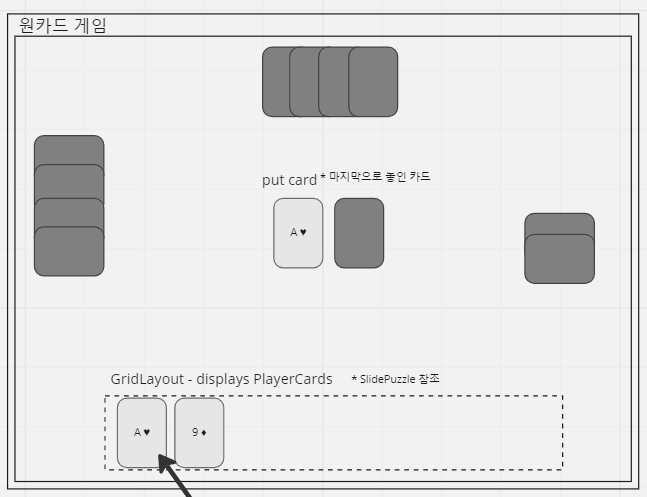

# 오픈소스S/W기초_group_G_보고서

**GIT 프로젝트 보고서**

**팀 구성(기준 5명)**

| 구분 | 이름 | 학과 | 학번 |
| --- | --- | --- | --- |
| 팀장 | 권세윤 | 소프트웨어학부 | 2021024184 |
| 팀원 | 강민경 | 소프트웨어학부 | 2022068640 |
| 팀원 | 김도윤 | 소프트웨어학부 | 2022079116 |
| 팀원 | 김동욱 | 소프트웨어학부 | 2022006535 |
| 팀원 |  |  |  |
- 팀원 구분은 역할로 나눌 수 있음

**프로젝트 개요**

프로젝트의 목적, 의의 등 해당 프로젝트를 진행하게 된 이유를 설명할 수 있는 내용으로 구성

이 프로젝트는 처음 만나서 토의도중 언어를 java로 결정한 뒤 서로 프로젝트에 대한 의견을 내서 나온 이메일 보조 프로그램(의견: **권세윤**), 채팅 앱(의견: **김동욱**), 원카드 게임(의견: **강민경**), 스터디 카페 시스템(의견:**김도윤**), 오목 게임(의견:**김도윤**), 도착지 설정 후 가까이 가면 알림서비스(의견:**김도윤**) 이 나왔고 그중 인당 2표씩 각각 행사해서 뽑은 주제이다. 이 프로젝트를 통해 협업하는 방법을 배우고 GIT을 사용해서 Pull Request를 하는 방법도 배워감으로써 조금더 프로그래머로써의 역량을 늘려갈 수 있을 것 입니다.

**예상도**

**프로젝트 대시보드**

[Sign up | Miro | Online Whiteboard for Visual Collaboration](https://miro.com/app/board/uXjVPCuNxXA=/)

**역할 분담**

팀 구성원이 해당 프로젝트에서 수행한 역할 등을 요약

일단 팀 프로젝트가 시작되자마자 민경님이 MVC아키텍쳐를 대략적으로 만드셔서 만들어야 할 것들을 일단 시각화 하셨다. 이때 도윤님은 역할분담에서 필요한 것들을 정리하시고 원카드 게임의 규칙을 정리해서 올려 주시고 두 분이 다른 자료를 바탕으로 추가적인 그림들을 miro에 올려주셨다. 이 테이블의 주소는 다음과 같다.( ) 이때 보고서의 작성자인 나는 다른 팀원들을 git에 추가해 드렸고, git에 시험삼아 파일을 올려보고 잘 작동함을 확인했다. 19일날 zoom을 통한 회의를 했으며 동욱님이 클래스{Card, CardDeckStart, CardDeckPut, CardDeck, CardPlayer}와 인터페이스{CardPlayerBehavior}에 대한 명세표를 작성하기로 하였고, 나는 보고서와 클래스{Dealer, OneCardController, HumanPlayer, ComputerPlayer, OneCardWriter}에 대한 명세표를 작성하기로 하였다. 민경님과 도윤님은 본인들이 미리 작성해놓은 것들에 더해서 추가적으로 참고하면 좋을 자료들과 덜 작성된 부분들을 수정하기로 하였고 목요일날 시험이 끝나고 다시 한번 모여서 코드를 짜기로 하였다. 코드는 다음과 같이 나눠서 작성하기로 했다. 1. OneCardWriter GUI부분(강민경), 2. CardDeck과 Dealer부분(김도윤), 3. CardPlayer와 main부분(김동욱) 4. Controller와 보고서(MD파일과 워드파일).

GIT 저장소의 Readme.md 파일에도 프로젝트 진행과정과 내용을 포함시킬 것.(최종 결과 때까지 올리겠습니다.)

**문제 및 해결(매주)**

프로젝트 진행 중 발견하거나 겪었던 문제점과 해결 과정을 기술 (간략하고 명료하게)

- 1주차

일단 이번 주에 토의하면서 있었던 문제는 원카드게임을 만드는데 GUI로 구현이 가능한지, 그리고 카드 여러 장을 순서대로 내도록 만들 수 있느냐가 관건이 되었습니다. 일단 GUI보단 콘솔 앱부터 만든 뒤에 가능하면 GUI도 만들기로 하였고, 카드 여러 장을 순서대로 내도록 만들기는 어려울 것 같아서 규칙을 조금 수정하였습니다. 그리고 명세표와 MVC아키텍쳐를 만드는 가운데 abstract class인 CardPlayer와 그의 buffer class인 HumanPlayer와 ComputerPlayer에서 receiveCard함수에 대해 overriding을 할지 아니면 abstract function으로 만들지, 따로 만들지 상의를 통해 따로 만들기로 결정했습니다.

- 2주차

2주차에서 GUI를 만들 때 카드 하나하나를 다 버튼으로 만드는 방법과 viewin 이랑 viewout 나눈 것처럼 입력은 따로 받고 writer는 gui만 출력하는 방법, 그리고 Writer에서는 컨트롤러 하나 생성해서 사용하는 방법으로 총 3개의 의견이 나왔고 마지막 의견을 채택했습니다. 그리고 ComputerPlayer를 만들 때, Constructor에서 받는 인자중에 int id를 넣을 필요가 있는지에 관해 고민했고 안 쓰기로 결정했습니다. 그 외에는 함수는 똑같은데 조금 더 읽기 쉬운 이름의 변수나 함수를 사용하기위해 클래스{Dealer, OneCardController, HumanPlayer, ComputerPlayer, OneCardWriter}를 비교해 보았습니다. 그 외에 Pull Request를 보내고 Merge하는 방법에 대한 웹페이지를 단체 채팅방에 올려서 사람들이 조금 더 활발하게 GIT을 사용할 수 있도록 했습니다.

---

---

명세표

- **-------------------------------깃 허브_contributor_목록------------------------------**

**프로젝트 평가 및 향후 과제(최종 보고서에 포함)**

- 계획과 결과에 대한 평가.
- 현 프로젝트에서 내세우고 싶은 점
- 프로젝트의 개선 또는 발전 방향 제시
- 기타
-